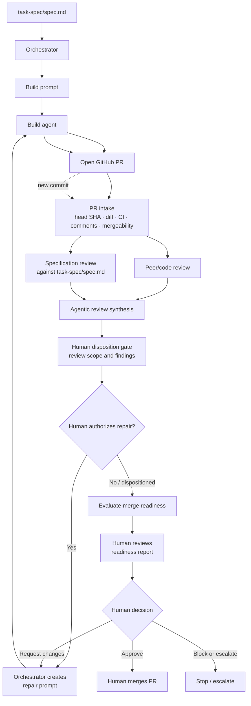

# Tier 3 Review Flow

This diagram shows the complete implementation, agentic review, repair, and human merge-readiness flow for the Guardrail API change.

## Stage summary

| Stage | Responsible party | Output or decision |
|---|---|---|
| Specification | Engineering team | `task-spec/spec.md` |
| Build assignment | Orchestrator | Copy-ready build prompt |
| Implementation | Build agent | Code changes and GitHub pull request |
| PR intake | Orchestrator | Current PR state and review scope |
| Peer review | Review agent | Code correctness and safety findings |
| Specification review | Review agent | Requirements and scope-fidelity findings |
| Agentic synthesis | Orchestrator | Consolidated findings and repair recommendation |
| Repair loop | Build agent | New commit on the PR branch |
| Merge-readiness evaluation | Orchestrator | Current-state readiness report |
| Final decision | Human reviewer | Approve, request changes, block, or escalate |

## Two review axes

### Peer/code review

Does the implementation work correctly, handle errors safely, remain maintainable, and include credible validation?

### Specification review

Does the pull request implement the requirements in `task-spec/spec.md` without missing behavior, compatibility regressions, or undocumented scope expansion?

## Repair loop

A new commit is not accepted as proof that a finding was fixed. After every repair push, the orchestrator refreshes the PR head SHA and sends the PR through the applicable review and validation steps again.

The live demonstration allows at most two repair/re-review cycles. If a
finding recurs, cannot be evaluated, or remains unresolved after the limit,
stop and report `NOT_READY` or `BLOCKED`. After every new commit, rerun both
review axes and the complete verification required by `task-spec/spec.md`;
targeted checks may supplement but must not replace the full suite, typecheck,
build, and scope checks.

The initial review records actionable findings as `Open`. The orchestrator
presents every finding to the human with severity, evidence, and proposed
action. Only human-authorized findings enter a repair prompt. The disposition
transition may then produce:

- `Open` — identified but not yet dispositioned or verified.
- `Fixed` — the finding was addressed and evidence was checked.
- `Declined` — the finding was investigated and rejected with a technical reason.
- `Tracked` — the work is intentionally outside the PR and has a verified follow-up reference.
- `Blocked` — progress requires a human decision or unavailable evidence.

## Human merge-readiness review

The human does not need to reread every line of the PR. The readiness report should summarize:

- The exact PR number and reviewed head SHA
- Whether the description matches the diff
- Agentic review findings and dispositions
- CI and validation status
- Open comments and review threads
- Merge conflicts and branch freshness
- Security, governance, and operational impact
- Remaining risks and required human action
- One final recommendation:
  - `READY_FOR_HUMAN_MERGE`
  - `NOT_READY`
  - `CHECKS_PENDING`
  - `BLOCKED`

Agents may prepare the report and recommend a disposition. Only the human approves and merges the pull request.
